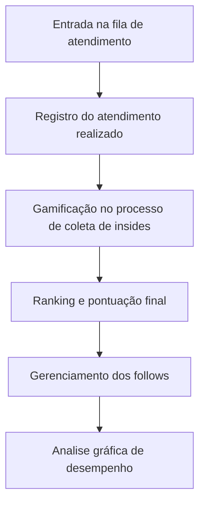

<h1 align="center">Gerenciador de vendas</h1>			
<br>
<h4 align="center"> 🚀 Em desenvolvimento 🚀 </h4>
	

Tabela de conteúdos
=================
<!--ts-->
   * [Sobre o projeto](#-sobre-o-projeto)
   * [Layout](#-layout)
   * [Como executar o projeto](#-como-executar-o-projeto)
     * [Pré-requisitos](#pré-requisitos)
     * [Funcionalidades](#Funcionalidades)
   * [Tecnologias](#-tecnologias)
   * [Autor](#-autor)
   * [Licença](#-licença)
<!--te-->


## 💻 Sobre o projeto

### Descrição:
Este projeto visa auxiliar o processo de vendas dentro da loja Brentwood, abrange a sistematização da fila de atendimento presencial, gerenciamento da carteira de clientes e analise de desempenho individual e como loja.

### Tecnologias Utilizadas:
 -Angular - Javascript ( Front end).
 -Python (Back end).
 -MySql (Banco de dados).
 -PowerBi (Analise de dados).
---

## 🎨 Layout


O layout da aplicação está disponível no pinteres:
<p>
  
  
  
  
  
  
  
  
</p>
	  
### Componentes Principais:
```bash
-AuthService: Biblioteca para gerenciamento das autenticações criptografadas
-HttpClient: Biblioteca Angular para gerenciamento de servidor local
-sqlalchemy: Biblioteca Python para manipulação de MySQL
-urllib: Biblioteca Python para criação de API da aplicação
-fastapi.middleware.cors: responsável por configurar regras de CORS (Cross-Origin Resource Sharing), permitindo ou restringindo requisições entre diferentes origens/domínios da aplicação.

```
---

#### Funcionalidades
```bash

 -Fila de atendimento: Cria uma fila organizando a ordem dos atendimento baseadas em ordem de chegada.
 -Registro de atendimento: Realiza perguntas personalizadas para coletar insides e registrar o fluxo de atendimento dos clientes em loja.
 -Agenda de clientes: Controle de agendamentos em uma apresentação inspirada na metódologia Kanban.
 -Cadastro de clientes: Apresentação dos dados cadasatrais dos clientes, integrado com o RP da empresa.
 -Histórico de atendimento: Apresentação do histórico dos atendimentos anteriores referente a aquele cliente, com dados do atendimento e fichas de recepção.
 -Gamificação: Qualidade dos atendimentos pontuadas e rankeadas para facilitar a auto-avaliação do colaborador, insentivar a busca por melhoria e facilitar o feedback por parte da liderança.
 -Analise gráfica: gráficos individuais e em grupo representando os insides dos clientes e deixando fácil interpretação.

```
### 🧑‍💻Guia do Usuário:




## 🛠 Tecnologias

As seguintes tecnologias foram usadas na construção do projeto:

-   **[HTML/CSS](https://developer.mozilla.org/pt-BR/docs/Web/HTML)** 
-   **[JavaScript/Angular](https://angular.dev/)** 
-   **[Python](https://www.python.org/)**
-   **[MySQL](https://www.mysql.com/)**
---

## 🦸🏻‍♂️ Autor

 <br>
  <sub><b><p>Christopher Silva</p></b></sub></a>
 <br />

[](https://www.linkedin.com/in/chris-f-silva/) 
[](mailto:chrisspfc.silva@gmail.com)

---

## 📝 Licença

Este projeto está licenciado sob a licença MIT - veja o arquivo LICENSE para mais detalhes.. [MIT](./LICENSE)

Feito por: Christopher Silva
